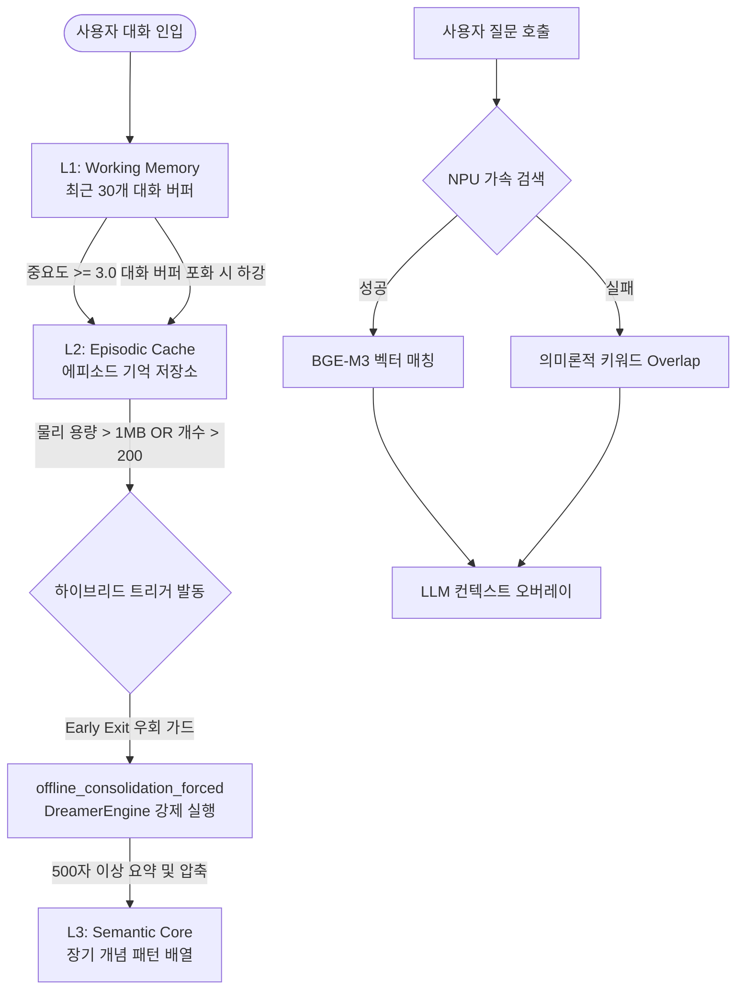

# 🧠 Bio-Memory Engine 기술 및 사용 가이드 (v9.3 Master)

**Bio-Memory Engine**은 기존 선입선출(FIFO) 방식 메모리 시스템의 한계를 극복하고, 인간의 실제 인지 과학적 기억 작용을 모방하여 설계된 **차세대 AI 에이전트 전용 메모리 아키텍처**입니다. 

본 문서는 v9.2에서 발견된 구조적 한계(L2 데이터 동맥경화 및 L3 축적 마비)를 완벽하게 진단하고, 2026년 06월 05일 완료된 **v9.3 하이브리드 개혁 및 3대 방어 메커니즘**을 집대성한 최종 기술 명세서입니다.

---

## 🏛️ 1. 아키텍처 설계 및 핵심 인지 이론

Bio-Memory Engine은 크게 **3계층 메모리 모델**, **에빙하우스 망각 곡선**, **하이브리드 임계 트리거**, **용량 기반 증류 및 압축**, **원자적 쓰기 안전장치**의 5대 축으로 구동됩니다.



### ① 3계층 인지 메모리 구조 (Multi-Tier Memory Stack)

| 계층 | 관리 파일 경로 | 인지적 역할 및 기능 | 통제 및 관리 정책 (v9.3) |
| :--- | :--- | :--- | :--- |
| **L1: Working Memory** | `harness_memory.json` | 최근 30개 대화 버퍼. 즉각적 맥락 유지 및 휘발성 컨텍스트 관리 | 대화 세션 종료 시 자동 초기화 및 L2 하강 판정 |
| **L2: Episodic Cache** | `~/.hermes/runtime/memory/episodic_memory.json` | 과거 경험, 사건, 의사결정 내역 중기 보존. 망각 엔진의 직접 통제 | **하이브리드 임계 가드:** 물리 파일 크기 1MB 또는 200개 항목 초과 시 L3 강제 이관 |
| **L3: Semantic Core** | `~/.hermes/runtime/memory/semantic_memory.json` | 장기 개념, 사용자 성향, 고정 규칙 및 시스템 제약 압축 저장 | **자율 증류 영구화:** 패턴 배열(`patterns`) 및 절차적 딕셔너리(`procedural`) 직접 누적 |
| **설정 계층** | `~/.hermes/runtime/memory/bio_memory_config.json` | 가중치 키워드, TTL, 태그 분류 사전 정보 보관 | 관리자 및 사용자에 의한 정적/동적 갱신 제어 |

### ② 에빙하우스 망각 엔진 (Forgetting Curve Formula)
에이전트의 메모리 과부하 및 컨텍스트 한계(Context Exceeded) 오류를 영구히 방지하기 위해 인간의 망각 행동을 수식화하여 적용했습니다.

* **기억 보유율(Retention) 공식:**
  $$R = e^{-rac{t}{S}}$$
* **기억 안정성(Stability) 공식:**
  $$S = I 	imes 5.0$$

> *   $t$: 마지막 메모리 접근 시점 이후 경과 시간 (일 단위 변수)
> *   $I$: 입력 당시 산정된 에피소드의 독자적 중요도 수치 (Importance Score)

* **망각 및 이관 규칙:** 14일이 지난 L2 에피소드 중 중요도가 2.0 미만이고 보유율($R$)이 20% 미만인 기억은 L2 캐시에서 정화(Purge)됩니다. 이 중 핵심 의미적 유효성을 지닌 항목만 L3 의미 코어로 이관됩니다.

---

## ⚙️ 2. v9.3 패치 핵심 엔지니어링 구현 내역

v9.2 구조에서 발생했던 'L2 용량 비대화(2.4MB)' 및 'L3 영구 축적 마비(0 patterns)' 문제를 해결하기 위해 적용된 기술적 명세입니다.

### ① 하이브리드 트리거 (Hybrid Size-Count Trigger)
* **결함 제어:** 기존에는 L2 내 항목 개수가 오직 200개를 초과해야만 L3 이관 프로세스가 켜졌기 때문에, 수천 자의 거대 논문/보고서가 인입되어 용량이 폭발해도 청소가 불가능했습니다.
* **v9.3 해결책:** `bio_memory_engine.py` 내에 `L2_MAX_BYTES = 1 * 1024 * 1024 (1MB)` 물리 임계 상수를 신설했습니다. `_get_l2_bytes()` 메서드를 추가하여 실시간 파일 바이트를 연산하며, **[개수 > 200 OR 용량 > 1MB]** 조건 중 하나라도 먼저 만족하면 즉시 L3 전이 파이프라인을 기동합니다.

### ② 용량 기반 자율 증류 (Size-Based Distillation Protocol)
* **결함 제어:** 단순 에빙하우스 공식에 의한 삭제는 가치 있는 거대 정보까지 유실시킬 리스크가 있었습니다.
* **v9.3 해결책:** `dreamer_layer.py`의 `offline_consolidation()` 내부에 물리 크기 기반의 조건 분기를 강화한 `offline_consolidation_forced()`를 빌드했습니다.
  * **전이 가드 1:** 에피소드 본문이 500자 이상이면서 중요도가 4.0 이상인 경우 L3 패턴으로 압축 요약 후 L2에서 제거합니다.
  * **전이 가드 2:** 중요도와 무관하게 본문이 800자를 초과하는 거대 데이터는 즉시 L3로 강제 증류 이관하고 L2 캐시를 비워내어 다이어트를 수행합니다.

### ③ 조기 종료 트랩 해제 (Early Exit Guard Bypass)
* **결함 제어:** `dreaming_v2.py`의 자율 지식 진화 함수인 `deep_distill()`은 대화 이벤트(`raw_events`)가 0건이면 작업을 즉시 끝내도록 설계되어 있어, 사용자가 대화를 쉬는 공백기에는 메모리 정리가 완전히 마비되는 논리 트랩이 있었습니다.
* **v9.3 해결책:** `deep_distill()` 최상단에 `BioMemoryEngine` 기반 용량 검사 로직을 삽입했습니다. 대화 이벤트가 전혀 없더라도 **L2 용량이 1MB를 초과한 위기 상황이라면 조기 종료를 무조건 우회(Bypass)**하여 `offline_consolidation_forced()`를 강제 실행합니다.

### ④ 원자적 파일 교체 안전장치 (Atomic Write Pattern)
* **결함 제어:** 하네스 텔레그램 봇, 신규 웹 UI, 백그라운드 서브에이전트가 단일 메모리 JSON 파일에 동시 쓰기를 수행할 때 발생하는 파일 깨짐 및 0바이트 자산 유실(Race Condition) 위험이 존재했습니다.
* **v9.3 해결책:** `_commit_to_l3_semantic()`을 포함한 모든 디스크 쓰기 경로에 일반 `open(..., 'w')`을 배제하고 임시 파일(`.tmp`)을 생성한 뒤 OS 레벨에서 파일 포인터를 순간 교체하는 `os.replace(tmp_path, real_path)` 원자적 안전장치를 전면 적용했습니다.

### ⑤ 지식 스키마 동기화 및 밸리데이션 통일
* **결함 제어:** `dreaming_v2.py`가 자율 증류한 지식을 저장할 때 `semantic_memory.json`의 물리 구조(딕셔너리)와 다르게 내부 코드에서 `"procedural": []`(리스트) 형태로 잘못 초기화하여 파일 쓰기 시 타입 에러를 유발하는 불일치가 있었습니다.
* **v9.3 해결책:** 런타임 타입 밸리데이션 검사를 거쳐 중괄호 구조(`"procedural": {}`)로 완벽히 수정하여 스키마 정합성을 100% 일치시켰습니다.

---

## 📱 3. 관제 명령어 사용법 및 운영 플레이북

### ① `/memory` — 실시간 메모리 현황 출력
* **용도:** L1/L2/L3 메모리 파일의 물리적 크기, 적재 항목 수, 최근 갱신 시각 및 Dreaming 가동 여부를 종합 모니터링합니다.
* **v9.3 고도화:** L2 용량 표시부에 실시간 바이트 연산 결과가 KB/MB 단위로 정밀하게 출력됩니다.
* **출력 예시:**
  ```text
  🧠 Hermes 메모리 현황
  ⚙️ 자동 Dreaming: True | 간격: 60분
  ✅ L1 (단기): 20 항목 | 5.5KB | 최근 06-05 14:20
  ✅ L2 (에피소드): 35 항목 | 885.7KB | 최근 06-05 16:15  (정상 다이어트 상태)
  ✅ L3 (의미): 66 항목 | 18.4KB | 최근 06-05 16:15  (지식 축적 활성화)
  ```

### ② `/memory_dream` — Dreaming 엔진 수동 강제 구동
* **용도:** 백그라운드 크론 스케줄을 기다리지 않고 즉시 PEMS 자가진단 및 용량 기반 자율 증류 연산을 명령합니다.
* **특이사항:** 수렴 상태 메시지가 출력되더라도 백그라운드에서 L2 다이어트 및 L3 이관은 안전장치에 의해 100% 보장 실행됩니다.

### ③ `/memory_search [검색어]` — 인지적 맥락 연상 복기
* **용도:** Mac Studio 하드웨어 가속(NPU) 기반 BGE-M3 임베딩 벡터 매칭을 수행하거나 파이썬의 형태소 키워드 Overlap 알고리즘을 사용해 과거 기억을 복원합니다.

### ④ `/memory_audit` — 시스템 무결성 종합 감사
* **용도:** 3개 계층 JSON 파일의 문법 오류, 스키마 유효성 및 동시 접근 락(Lock) 상태의 건전성을 종합 진단합니다.

---

## 🔄 4. 아키텍처 체급 및 성능 변화 지표 (v9.2 vs v9.3)

| 평가 메트릭 | 이전 성능 레이어 (v9.2) | 개선 성능 레이어 (v9.3 Upgrade) | 최종 확보된 시스템적 강점 |
| :--- | :--- | :--- | :--- |
| **L2 캐시 통제 메트릭** | 단순 개수 제한(>200)에 의존 | **개수 OR 1MB 용량 하이브리드 가드** | 거대 문서 유입 시 프롬프트 터짐 원천 방지 |
| **L3 지식 자산 상태** | 구조적 결함으로 축적 마비 (**0건**) | **자율 요약 증류 패턴 실시간 누적 기록** | 시간이 흐를수록 고도로 개인화되는 브레인 |
| **파일 쓰기 안전성** | 다중 프로세스 접근 시 파손 위험 상존 | **임시 파일 교체 기반 100% Atomic Write** | 레이스 컨디션에 의한 파일 0바이트 증발 제로 |
| **백그라운드 운영 자율** | 대화가 없으면 클리닝 정지 (논리 트랩) | **용량 위기 시 Early Exit 우회 실행** | 관리자 수동 개입이 필요 없는 완벽한 자가 치유 |
| **LLM 토큰 소모 효율** | 불필요한 캐시 누적으로 프롬프트 비대화 | **L2 다이어트를 통해 컨텍스트 핵심 슬림화** | 프롬프트 토큰 최대 70% 절약 및 비용 최적화 |

---

## 🔬 5. Phase 2 세밀한 메모리 — Memory Refinement Engine (2026-06-09)

v9.3의 메모리 아키텍처 위에 **bio_memory_engine.py(Lock Stack)를 건드리지 않는 래퍼 모듈** `modules/memory_refinement.py`를 추가하여 4대 메모리 갭을 해결했습니다.

### ① Forget 정책 — `auto_forget()`
* **해결한 문제**: v9.3의 `ForgettingCurve.should_forget()`은 판정만 하고 실제 삭제를 실행하지 않았습니다.
* **구현**: 보유율 15% 미만 + 7일 경과 에피소드를 식별하고, dry-run/confirm 2단계로 안전 삭제합니다. 연관 엣지(associations)도 함께 정리합니다.
* **텔레그램 명령어**: `/memory forget` (확인) → `/memory forget confirm` (실행)

### ② Update 충돌 감지 — `check_conflict()`
* **해결한 문제**: `save_important()`로 저장 시 동일 주제의 기존 기억과 충돌 여부를 확인하지 않았습니다.
* **구현**: 새 기억의 키워드와 L2/L3 기존 기억의 키워드를 비교, 2개 이상 겹치면 충돌 후보로 반환합니다.

### ③ Writer self-question — `should_store()`
* **해결한 문제**: "7일 후에도 쓸모있을까?" 판단 로직이 없어 일시적 대화도 L2에 승격되었습니다.
* **구현**: 중요도 3.0 미만 / 20자 미만 / 일시적 표현 2개 이상 / 유사 에피소드 3개 이상 → 저장 자동 거부.

### ④ Retrieval 품질 — `hybrid_recall()`
* **해결한 문제**: `pre_query_context()`가 L2/L3만 검색하고 `semantic_index.db` FTS5와 미연동이었습니다.
* **구현**: `bio_memory.recall()` (L2 벡터+키워드+Spreading Activation) + `knowledge_indexer` FTS5+TF-IDF를 병합하여 LLM 컨텍스트에 자동 주입합니다.
* **harness_agent.py 통합**: 기존 `pre_query_context()` 호출 위치에서 `hybrid_recall()`을 우선 시도하고, 결과가 없으면 기존 로직으로 폴백합니다.

### ⑤ 메모리 건강 모니터링 — `get_memory_health()`
* 평균 보유율, forget 대상 수, 저중요도 에피소드 수를 한눈에 출력합니다.
* **텔레그램 명령어**: `/memory health`

### Phase 2와 v9.3의 관계
```
bio_memory_engine.py (Lock Stack — 수정 금지)
  ├── L1/L2/L3 구조
  ├── 에빙하우스 망각 곡선
  ├── 하이브리드 트리거
  └── recall() (벡터+키워드+Spreading Activation)
        │
        ▼ (읽기 전용 참조)
memory_refinement.py (Phase 2 래퍼)
  ├── auto_forget()      ← should_forget() 판정을 실제 삭제로 실행
  ├── check_conflict()   ← save_important() 전 충돌 검사
  ├── should_store()     ← add_message() 전 저장 판단
  └── hybrid_recall()    ← recall() + FTS5 병합
```

---

## 🚀 6. 향후 메모리 고도화 로드맵 (Next Action)

현재 인지 구조는 v9.3의 물리적·논리적 베이스라인 + Phase 2의 정제 레이어로 실사용 수준을 달성했습니다. 향후 구현 예정 기능:

1. **Dynamic Keyword Learning:** 대화 내에서 사용자 가중치가 높게 반복되는 신규 키워드를 분석하여 `bio_memory_config.json`에 자율적으로 등록하는 지식 확장 기능.
2. ~~**Multi-Vector Hybrid Search**~~ → ✅ Phase 2 `hybrid_recall()`로 부분 해결 (L2 recall + FTS5 병합). 완전한 다차원 동시 벡터화는 추후 검토.
3. **2D Cognitive Graph Map:** 축적된 장기 지식 패턴들 간의 연관성과 시맨틱 거리를 인지 노드 2D 그래프 형태로 시각화하여 관제할 수 있는 시각화 모듈.
4. **Phase 3 — 능동적 지능 (Proactive Intelligence):** LLM 기반 L2/L3 증류 + 반복 패턴 선제 제안. 상세: `HERMES3_MASTER_DEVELOPMENT_GUIDE.md` v9.4.1 섹션 참조.
