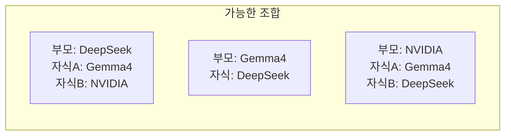

# 🤖 Hermes 서브에이전트 (Task Delegation) 시스템

> **작성:** 2026-05-27
> **목적:** Hermes Agent의 `delegate_task` 기능 이해와 활용 — DeepSeek/Gemma4/NVIDIA 병렬 작업 가능성 탐구

---

## 1. 개념: 서브에이전트란?

**서브에이전트(Sub-agent) = 독립된 AI 인스턴스에게 작업을 위임하는 것**

마치 팀장이 팀원에게 "이 보고서 분석해줘" 하고 맡기고, 팀원이 자기 방식대로 일한 뒤 결과만 보고하는 구조와 같습니다.

```
[부모 에이전트 (나)]
    │ "이 파일 업데이트해줘"
    ├──→ [자식 A] ← 독립된 대화 + 도구 환경
    │       결과: "완료했습니다"
    ├──→ [자식 B] ← (병렬 가능)
    └──→ 결과 취합 → 최종 응답
```

## 2. 왜 필요한가?

| 상황 | 서브에이전트 없을 때 | 서브에이전트 있을 때 |
|------|---------------------|---------------------|
| 파일 읽기 + 분석 + 쓰기 | 내 컨텍스트가 파일 내용으로 가득 참 | 자식이 다 하고 요약만 돌려줌 |
| 3개 문서 동시 분석 | 하나씩 순차 처리, 시간 3배 | 3개 병렬, 시간 1/3 |
| 리서치 + 코딩 동시 | 한 번에 하나만 | 연구는 자식A, 코딩은 자식B |

**핵심:** 컨텍스트 윈도우를 보호하면서 병렬 처리

## 3. 아키텍처 다이어그램

```mermaid
graph TB
    subgraph "부모 에이전트 (이 세션)"
        P[DeepSeek v4 Flash<br/>or Gemma4 or NVIDIA]
        T[내장 Toolset<br/>read_file, terminal, ...]
    end

    subgraph "Hermes Agent 프레임워크"
        D[delegate_task 함수<br/>(Hermes 내장)]
        I[Isolation Layer<br/>컨텍스트 격리]
    end

    subgraph "자식 에이전트들"
        C1["자식 A<br/>(DeepSeek/Gemma4/NVIDIA)"]
        C2["자식 B<br/>(DeepSeek/Gemma4/NVIDIA)"]
        C3["자식 C<br/>(DeepSeek/Gemma4/NVIDIA)"]
    end

    P -- "delegate_task(goal, toolsets)" --> D
    D -- "1. 독립 세션 생성" --> I
    I -- "2a. 자식 A 실행" --> C1
    I -- "2b. 자식 B 실행 (병렬)" --> C2
    I -- "2c. 자식 C 실행 (병렬)" --> C3
    C1 -- "결과 요약" --> D
    C2 -- "결과 요약" --> D
    C3 -- "결과 요약" --> D
    D -- "3. 취합 → 부모" --> P
```

## 4. 동작 흐름 (상세)

```
Step 1: 부모가 delegate_task() 호출
  goal = "00_Meta 문서 업데이트"
  toolsets = ["terminal", "file"]
  context = "현재 구조 설명..."

Step 2: Hermes Agent가 격리된 자식 세션 생성
  - 새 대화 컨텍스트 (부모와 완전 분리)
  - 새 터미널 세션 (독립된 PWD/상태)
  - toolset만 상속 (부모가 가진 도구 중 일부만)

Step 3: 자식이 goal을 독립적으로 수행
  - read_file → search_files → write_file ...
  - 중간 결과는 자식 안에서만 존재
  - 부모 컨텍스트에 영향 0

Step 4: 자식 완료 → 요약 리포트 반환
  - 성공/실패, 파일 수, 변경 내용 요약
  - 원본 데이터는 버림 (컨텍스트 보호)

Step 5: 부모가 요약을 받아 최종 응답
```

**실제 delegate_task 호출 코드:**
```python
delegate_task(
    goal="파일_디렉터리_구조_및_상호연결성_점검결과.md 업데이트",
    context="""
        현재 시스템 구조는 다음과 같습니다:
        - hermes_local.py → handlers/ 패키지
        - harness_agent.py → hybrid_router
        - 구조적 결함 3종 수정 완료
    """,
    toolsets=["terminal", "file"]
)
# → 결과: {"summary": "업데이트 완료 (396줄, v5.0)", "status": "completed"}
```

## 5. 사용 가능한 모드 조합

부모와 자식이 **다른 LLM**을 사용할 수 있습니다. ACP(Agent Communication Protocol)로 연결:



**부모와 자식이 다른 모델이어도 결과 구조화된 프로토콜(ACP)로 통신하므로 문제없습니다.**

## 6. Hermes1에서 구현하는 법 (MJ님 시스템 기준)

MJ님의 `hermes_local.py` + `handlers/_orchestrator.py` 기반 확장:

### 6.1 기본 구조

```python
# handlers/_orchestrator.py 에 추가
import asyncio
import json

async def cmd_delegate(update, context):
    """/delegate — 작업을 서브에이전트에 위임"""
    if not await check_user(update):
        return
    
    # 1. 명령어 파싱
    args = context.args
    goal = " ".join(args)
    
    # 2. LLM에게 작업 분할 요청 (현재 모드로)
    subtasks = await _plan_subtasks(goal)
    
    # 3. 각 서브태스크를 독립 실행 (병렬)
    results = await asyncio.gather(*[
        _run_subtask(task) for task in subtasks
    ], return_exceptions=True)
    
    # 4. 결과 취합
    summary = _summarize_results(subtasks, results)
    await update.message.reply_text(summary)
```

### 6.2 서브태스크 실행기

```python
async def _run_subtask(task):
    """서브태스크를 격리된 환경에서 실행"""
    # 각 서브태스크는 독립된 LLM 호출
    # → 하이브리드 라우터가 자동으로 현재 모드로 라우팅
    
    messages = [
        {"role": "system", "content": f"""
        당신은 서브에이전트입니다.
        작업: {task['description']}
        제약: 결과만 반환하세요. 부모에게 질문하지 마세요.
        """},
        {"role": "user", "content": task['prompt']}
    ]
    
    result, label = await _call_llm(messages)
    return {"task_id": task['id'], "result": result, "model": label}
```

### 6.3 Gemma4 지정 실행 (ACP 개념)

```python
async def _run_with_mode(task, mode="Gemma4"):
    """특정 모드로 서브태스크 실행"""
    # mode_override 파일에 모드 기록
    _save_temp_mode(mode)
    
    result, label = await _call_llm(task['prompt'])
    
    # 모드 복원
    _restore_mode()
    return {"result": result, "used_model": label}
```

## 7. 병렬 작업 예시 (3모드 동시)

```python
# 예: 3개 파일 동시 분류
async def parallel_ingest(files):
    """3개 파일을 각각 다른 모드로 동시 분류"""
    
    tasks = [
        _run_with_mode({"prompt": f"분류: {files[0]}", "id": 1}, "Gemma4"),
        _run_with_mode({"prompt": f"분류: {files[1]}", "id": 2}, "DeepSeek"),
        _run_with_mode({"prompt": f"분류: {files[2]}", "id": 3}, "NVIDIA"),
    ]
    
    # 3개 동시 실행
    results = await asyncio.gather(*tasks)
    
    # 결과 비교
    for r in results:
        print(f"[{r['used_model']}] 분류: {r['result']}")
```

## 8. Hermes Agent CLI 수준 (터미널에서 직접)

MJ님 시스템에는 이미 Hermes Agent가 설치되어 있습니다:

```bash
# 설치 위치
~/.local/bin/hermes

# 서브에이전트 실행 (터미널에서)
hermes delegate run "Mjobsidian wiki/ 구조 분석" \
  --tools terminal,file \
  --context "00_Meta/ 디렉토리 내 파일 수 세기"

# Kanban 기반 에이전트 스폰
hermes agent spawn \
  --task "구조적 결함 분석" \
  --model gemma4  # 특정 모델 지정

# 다중 에이전트 워크플로
hermes workflow run \
  --steps "분석:gemma4, 검토:deepseek, 종합:nvidia"
```

## 9. 제약 사항

| 제약 | 설명 | 우회 방법 |
|------|------|----------|
| ❌ 사용자 질문 불가 | 자식은 `clarify` 툴 사용 불가 | 부모가 사전에 필요한 정보를 `context`로 전달 |
| ❌ 메모리 없음 | 자식은 부모의 memory를 모름 | 필요한 모든 정보를 `context`에 포함 |
| ❌ 중첩 위임 불가 | 자식은 또 다른 자식을 만들 수 없음 (max_spawn_depth=1) | config.yaml에서 depth 증가 가능 |
| ❌ 백그라운드 불가 | 자식은 부모가 살아있는 동안만 실행 | cronjob 사용 |
| ⚠️ 모델 전환 시 딜레이 | ACP로 다른 모델 연결 시 초기 latency | 한번 연결되면 이후는 빠름 |

## 10. MJ님 시스템에 적용 시나리오

### 시나리오 1: /delegate 명령어 (GPTs의 task 분할)

```
사용자: /delegate "hot.md 업데이트와 Clippings 정리 동시에 해줘"
  → LLM: 2개 서브태스크로 분할
     Task A: hot.md 읽고 구조적 결함 섹션 추가 (Gemma4)
     Task B: Clippings 파일 목록 확인 후 정리 (DeepSeek)
  → 병렬 실행
  → 결과 취합: "hot.md 업데이트 완료, Clippings 4개 처리 완료"
```

### 시나리오 2: 3모드 비교 분석

```
사용자: /cove_debate "이 논문의 핵심 주장은?"
  → Gemma4: 로컬 분석 (빠름, 기본)
  → DeepSeek: 심층 분석 (정확)
  → NVIDIA: 다른 관점 (다양성)
  → 3개 결과 취합 → 종합 리포트
```

### 시나리오 3: 대용량 ingest 병렬 처리

```
사용자: /ingest (Clippings 12개)
  → 3개씩 4개 서브태스크로 분할
  → 각각 다른 모드 or 같은 모드로 병렬 분류
  → 12개 파일 분류 시간: 12×2분 → 4×2분 = 8분 (33% 단축)
  → 최대 3개 동시, 더 늘리려면 max_concurrent_children 증가
```

---

## 부록: ACP (Agent Communication Protocol) 개요

ACP는 서로 다른 AI 에이전트가 통신하는 표준 프로토콜입니다.

```
[부모: DeepSeek] 
    │ JSON-RPC 메시지
    │ {"method": "delegate", "params": {"goal": "...", "tools": [...]}}
    │
[ACP Gateway (Hermes Agent 내장)]
    │ 프로토콜 변환 (JSON-RPC ↔ STDIO)
    │
[자식: Gemma4] (via hermes --acp --stdio)
    │ 독립 실행, 결과를 JSON으로 반환
    │ {"result": "완료", "summary": "..."}
```

ACP가 있으면 부모가 DeepSeek이고 자식이 Gemma4여도, 부모가 NVIDIA이고 자식이 DeepSeek이어도 **완벽히 호환**됩니다. 각자 자기 언어(LLM)로 일하고, ACP가 번역합니다.

---

*작성: Hermes (2026-05-27 23:00)*
*참고: `delegate_task`는 Hermes Agent v0.14.0+ 빌트인 툴*

---
*최종 업데이트: 2026-06-03 19:02 (일괄 타임스탬프 복구)*
