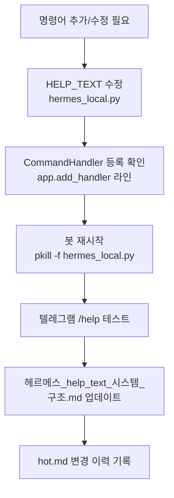

# 🤖 헤르메스 텔레그램 봇 — 명령어 완전 가이드

> **최종 업데이트:** 2026-06-03 21:30 (+ `/claude_brief` 명령어 추가, 34개 명령어)
> **관련 파일:** `hermes_local.py`, `handlers/_meta.py`, `스크립트 정보.md`, `runbook_telegram.md`
> **통합 이력:** `파일조작 명령어 가이드.md` 내용 흡수 후 삭제 (2026-06-03)

---

## 🧱 Part 1. Help Text 시스템 구조 (개발자/에이전트용)

### 왜 이 구조가 필요한가?

`hermes_handlers.py`는 **pyc 파일(컴파일된 바이트코드)로만 동작**합니다.
- `.py` 파일은 복구 불가능한 상태 (패딩 위장 파일)
- pyc는 읽기전용(0o444)으로 보호 → 직접 수정 불가
- **해결책:** `hermes_local.py`에서 HELP_TEXT 상수 + 함수 오버라이드 + monkey-patch로 우회

### 3단계 우회 구조

**1️⃣ HELP_TEXT 상수** — `hermes_local.py` 내 전역 변수로 정의

```python
HELP_TEXT = """🤖 **헤르메스 V2.5 명령어 가이드 (완전판)**
...
"""
```

**2️⃣ cmd_help 함수 오버라이드** — 동일 파일 내에서 pyc 함수 대체

```python
async def cmd_help(update, context):
    if not await check_user(update): return
    await update.message.reply_text(HELP_TEXT, parse_mode='Markdown')
```

**3️⃣ monkey-patch** — 버튼 핸들러("ℹ️ 도움말")도 새 함수로 교체

```python
_load_module('hermes_handlers').cmd_help = cmd_help
```

### 명령어 추가/수정 워크플로우



### ⚠️ 주의사항

1. **pyc 건드리지 말 것** — `hermes_handlers.py`는 바이너리. VSCode에서 열면 깨짐
2. **봇 재시작 필수** — HELP_TEXT는 프로세스 메모리에서만 적용됨
3. **줄바꿈 확인** — `"""` 삼따옴표 사용. `\\n` 이스케이프 있으면 텔레그램에서 줄바꿈 안 됨
4. **monkey-patch 순서** — handler 정의 직후, `_load_module`이 실행된 다음에 patch

---

## 📋 Part 2. 전체 명령어 목록 (34개, 2026-06-03 기준)

### 🔹 인텔리전스 & 팩트체크
| 명령어 | 설명 |
| :--- | :--- |
| `/ask [질문]` | 기본 답변 및 위키 기반 Q&A |
| `/cove [질문]` | Gemma4 CoVe 4단계 팩트체크 (devil 모드: `/cove devil <주장>`) |
| `/web [URL] [질문]` | 웹 주소 요약/분석 |
| `/search [검색어]` | 웹 브라우징 요약 |
| `/readweb [URL]` | 웹페이지 요약 |
| `/searchpaper [검색어]` | 논문 검색 (OpenAlex) |
| `/paper [명령]` | 논문 기능 (humanize/draft/review) |
| `/research [유형]` | 심층 리서치 (local/web/deep/stats/xref/classify/timeline) |
| `/reduce [질의]` | v9.0 core_reducer 통합 테스트 |

### 🤖 에이전트 & 자율 작업
| 명령어 | 설명 |
| :--- | :--- |
| `/orchestrate [목표]` | 에이전트 병렬 다중 실행 |
| `/exec [명령어]` | AI 자율 Bash 실행 (에러 자동 수정 포함) |
| `/delegate [작업]` | Task 분리 및 위임 |
| `/handoff` | 에이전트 핸드오프 |
| `/caveman` | 원시 모드(단순 응답) 토글 |

### 📁 파일 & Vault 관리
| 명령어 | 설명 | 확인 필요 |
| :--- | :--- | :---: |
| `/read [경로]` | 파일 안전 읽기 | ❌ |
| `/list [경로]` | 디렉토리 목록 출력 | ❌ |
| `/create [경로] [내용]` | 파일 생성 (inbox 제한 없음) | ✅ |
| `/move [원본] [대상]` | 파일 이동 | ✅ |
| `/copy [원본] [대상]` | 파일 복사 | ✅ |
| `/rename [파일] [새이름]` | 파일 이름 변경 | ✅ |
| `/delete [경로]` | 파일 삭제 (Mac 휴지통으로 이동, 복구 가능) | ✅ |
| `/confirm` | 보류 중인 작업 승인 | — |
| `/cancel` | 보류 중인 작업 취소 | — |
| `/ingest` | Clippings → 위키 자동 이관 | — |
| `/clip [텍스트]` | 클립보드 즉시 저장 | — |
| `/vault [명령]` | 보관소 진단 (check/duplicates) | — |
| `/grill [문서] [질문]` | Vault 문서 심층 Q&A | — |
| `/tag [명령]` | 태그 관리 (pending/approve/reject) | — |
| `/fs` | 파일 시스템 도구 모음 | — |

> ⚠️ **쓰기 작업(create/delete/rename/move/copy)은 `/confirm` 승인 후 실행됩니다.**  
> 허용 경로: `/Users/bluesea/Applications/`, `/Users/bluesea/hermes/`, `/Users/bluesea/.hermes/`

### 🧠 메모리 & 목표 관리
| 명령어 | 설명 |
| :--- | :--- |
| `/memory` | L1/L2/L3 Bio-Memory 상태 모니터링 (+ L2 자동 백업) |
| `/memory_search [검색어]` | 메모리 통합 검색 |
| `/memory_dream` | Dreaming 강제 실행 (PEMS 수렴 시에도 offline_consolidation 실행) |
| `/memory_audit` | 메모리 종합 감사 |
| `/dreaming` | 대화/작업 저널 분배 자동화 |
| `/goal [목표]` | 장기 목표 설정 및 관리 (`/goal clear`로 삭제) |

### 📊 모니터링 & 시스템
| 명령어 | 설명 |
| :--- | :--- |
| `/recent` | 최근 수정 문서 출력 |
| `/status` | 시스템 핫토픽 점검 |
| `/claude_brief` | 6대 메타 문서 브리핑 생성 → claude_briefing.md |
| `/kanban` | 칸반 보드 상태 및 관리 |
| `/audit` | 시스템/인프라 종합 감사 |
| `/secreview` | 보안 코드 리뷰 |
| `/restart_bot` | 봇 프로세스 재시작 |
| `/model` | 모델 설정 상태 |
| `/profile [모드]` | 작업 모드 변경 |

### 🛡️ 하네스 컨트롤
| 명령어 | 설명 |
| :--- | :--- |
| `/harness` | ACID 하네스 상태 제어 |
| `/hdod` | 하네스 DoD 진단 |
| `/hstatus` | 시스템 진단 리포트 |
| `/hrollback` | 의사결정 롤백 실행 |

---

## 💡 Part 3. 자주 쓰는 파일 조작 패턴

```
# 파일 읽기
/read wiki/00_Meta/hot.md

# 새 노트 만들기 → 분류
/create inbox/아이디어.md 내용...
/move inbox/아이디어.md wiki/10_AI_Automation/

# 파일 정리
/list wiki/00_Meta/
/delete 임시파일.md   →   /confirm

# 봇 재시작
/restart_bot
```

---

## 🔗 관련 문서

- [`스크립트 정보.md`](file:///Users/bluesea/Applications/Mjobsidian/wiki/00_Meta/02_스크립트%20정보.md) — 전체 시스템 스크립트 구조
- [`runbook_telegram.md`](file:///Users/bluesea/Applications/Mjobsidian/wiki/00_Meta/runbook_telegram.md) — 봇 운영 SOP
- [`hermes_local.py`](file:///Users/bluesea/Applications/Mjauto/Scripts/hermes_local.py) — HELP_TEXT 실제 코드

---
*최종 업데이트: 2026-06-03 19:11 — 파일조작 명령어 가이드 흡수 통합, 33개 완전판*
