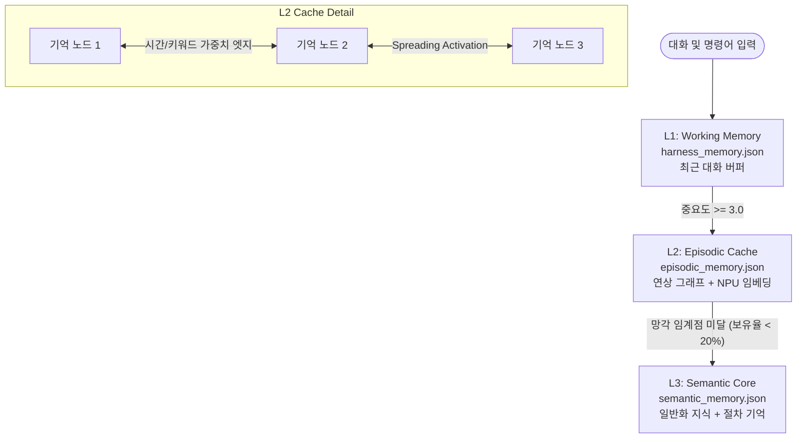

# 🧠 Bio-Memory Engine 기술 가이드 및 사양서 (v2.0)

**Bio-Memory Engine**은 인간의 뇌 인지 구조(3계층 메모리 모델) 및 에빙하우스 망각 곡선을 모방하여 설계된 Mac Studio NPU 하드웨어 가속형 AI 메모리 아키텍처입니다. 기존 flat RAG 및 단순 대화 버퍼 누적 방식의 한계를 극복하고, 정보의 연상 결합과 자율적 절차 기억을 지원합니다.

---

## 🏗️ 1. 3계층 인지 메모리 아키텍처 (Multi-Tier Architecture)

Bio-Memory Engine은 정보를 중요도와 시간에 따라 L1, L2, L3의 세 가지 기억 공간으로 나누어 관리합니다.



### 1) L1: Working Memory (작동 기억)
- **물리 파일**: `Scripts/harness_memory.json`
- **용도**: 최근 나누는 실시간 대화의 휘발성 버퍼 (최대 30개 항목 제한).
- **특징**: 기존 Harness 및 MacBot 시스템과의 **100% 하위 호환성**을 위해 동일한 파일 포맷을 유지하며 동작합니다.

### 2) L2: Episodic Cache (에피소드 기억)
- **물리 파일**: `~/.hermes/memory/episodic_memory.json`
- **용도**: 시간적/의미적 인과 관계가 존재하는 컨텍스트 기억 저장소 (최대 200개 제한).
- **특징**:
  - **NPU 가속**: Apple Silicon NPU 기반 BGE-M3 임베딩 엔진(`semantic_engine.py`)을 이용한 Dense 벡터 코사인 유사도 검색.
  - **연상 메모리 그래프**: 기억 노드 간의 **시간차(Temporal)** 연결과 **공유 키워드(Semantic Keyword)** 연결망 엣지 자동 구성.
  - **활성화 확산(Spreading Activation)**: 검색어와 직접 매칭되지 않아도, 의미망을 통해 연관 기억을 연쇄적으로 인출(Recall).

### 3) L3: Semantic Core (장기 시맨틱 코어)
- **물리 파일**: `~/.hermes/memory/semantic_memory.json`
- **용도**: 압축 정화된 일반화 규칙, 사용자의 영구적인 프로필/선호도, 자율 명령 복구 이력 저장소.
- **특징**:
  - **에빙하우스 망각 엔진**: L2 캐시에서 인출 횟수가 적고 14일 경과 시 보유율이 20% 미만으로 떨어지는 노드는 자동으로 소멸되며, 핵심 정보만 L3로 압축 이관됩니다.
  - **절차 기억 (Procedural Memory)**: 실행기(`executor.py`)가 Bash 에러 자율 복구에 성공한 명령어 흐름(Original CMD ➔ Fixed CMD)을 캐싱하여, 향후 동일/유사 에러 발생 시 LLM API 호출 없이 즉각 🧠 연상 복구하도록 지원합니다.

---

## 🛠️ 2. 핵심 알고리즘 및 수학적 모델

### 1) 에빙하우스 망각 보유율 공식
보유율 $R$은 다음과 같이 정의됩니다.
$$R = e^{-\frac{t}{S}}$$
- $t$: 마지막 인출 또는 생성 시점으로부터 경과 시간 (일 단위)
- $S$: 기억 강도 (최초 중요도 점수 $\times$ 누적 인출 횟수 가중치)
- **망각 정화**: $R < 0.20$ (보유율 20% 미만)인 기억은 L2에서 삭제 후 L3로 압축 전환.

### 2) 활성화 확산 (Spreading Activation)
1. **초기 스코어링**: 유사도(80%) + 에빙하우스 보유율(20%)로 검색어 기반 초기 점수($S_{init}$) 계산.
2. **1-Hop 활성화 전파**: $S_{init} > 2.0$인 노드에 대해, 연결된 모든 이웃 노드 $j$에 전파 점수 누적.
   $$S_{prop}(j) = \sum (S_{init}(i) \times W_{ij} \times D)$$
   - $W_{ij}$: 엣지 가중치 (시간 연결: 1.0, 키워드 연결: 공유 수에 따라 0.4 ~ 1.0)
   - $D$: 감쇄 계수 (Decay Factor = 0.5)
3. **최종 랭킹**: $Score_{final} = (S_{init} \times 0.7) + (S_{prop} \times 0.3)$

---

## 🧠 3. 지식 그래프 및 감정/맥락 연상 탐색의 동작 원리

Neo4j와 같은 무거운 외장 그래프 DB를 직접 띄우지 않고도, 초경량 인메모리 그래프 구조와 JSON 직렬화를 통해 다차원 맥락 기억을 탐색합니다.

### 1) 노드와 엣지 설계 (감정/맥락의 표현)
- **노드 (Node - 기억과 중요도의 결합)**: LLM이 판단한 인지적 중요도(`importance`, 1.0~5.0)와 복기 횟수(`recall_count`)를 종합하여 기억 강도($S$)를 결정하고 해마(L2 캐시)에 인코딩합니다.
- **시간적 엣지 (Temporal Edge, $W_{temp} = 1.0$)**: 대화 세션 내에서 시간 연속적으로 발생한 에피소드(예: 사용자 입력 -> 터미널 에러 -> 복구 실행)를 엮어주는 맥락 연결선입니다.
- **의미적 키워드 엣지 (Semantic Edge, $W_{sem} = 0.4 \sim 1.0$)**: 두 노드가 공유하는 핵심 키워드(Overlap) 수에 비례해 형성되는 시냅스 연결 가중치입니다.

### 2) 활성화 확산 (Spreading Activation) 탐색
단순 유사도 검색은 질문과 단어 자체가 겹치거나 코사인 거리만 가까운 텍스트를 찾지만, 활성화 확산은 연상 작용을 모사합니다.
1. **초기 주입**: 사용자의 새 입력과 임베딩 유사도가 높은 L2 노드에 초기 에너지(예: `Score = 3.0`)를 부여합니다.
2. **에너지 전파**: 연결된 엣지의 가중치($W$)와 감쇄 상수(Decay, 0.5)를 곱해 인접 이웃 노드로 에너지를 흘려보냅니다.
3. **연상 리콜**: "A를 지시했다"는 노드가 활성화되면 엣지로 강하게 연결된 **"보통 이 상황에서 B를 원했다"** 또는 **"과거에 A를 할 때 이런 에러가 났었다"**는 패턴 노드가 함께 에너지를 받아 임계점을 넘으며 **동시 활성화(Fire)**되어 컨텍스트로 리콜됩니다.

### 3) 선호 패턴 노드("A ➔ B 원함")의 L3 고착화
1. **L2 그래프 누적**: 사용자가 A를 말하고 비서가 B를 처리해 준 성공 맥락이 L2 내에 엣지로 축적됩니다.
2. **패턴 일반화**: Dreaming 정리 주기(`/memory_dream`) 동안, 자주 함께 활성화된 강한 결합 관계망을 포착합니다.
3. **L3 시맨틱 이관**: 개별 대화 파편은 삭제하되 **"사용자는 [A] 상황에서 [B] 처리를 선호한다"**는 요약된 추상화 패턴 노드를 생성하여 L3 영구 기억에 고착화(Consolidation)시킵니다.

---

## ⚙️ 4. 명령어 및 API 사용 가이드

### 1) 텔레그램 봇 명령어
- `/memory` : 현재 L1, L2(기억 수, 연상 고리 엣지 수), L3(규칙 수, 절차 패턴 수)의 생체 구동 상태 보고.
- `/memory_search [검색어]` : NPU 가속 세만틱 검색 및 연상 그래프 확산을 통한 과거 대화 맥락 인출 및 리스트업.
- `/memory_dream` : 수동으로 에빙하우스 망각 정리 루틴을 즉시 가동하여 오래된 기억 정화 및 L3 이관 압축 수행.

### 2) Python API 개발자 연동
```python
from bio_memory_engine import BioMemoryEngine

mem = BioMemoryEngine()

# 대화 추가 (L1 자동 저장 및 조건 충족 시 L2 승격)
mem.add_message("user", "박사님은 오늘 새로운 Swift UI 모듈 연동을 시작하셨습니다.")

# 하이브리드 연상 기억 인출
context_list = mem.recall("Swift UI 연동", top_k=3)

# 절차 기억(Procedural Memory) 등록 (성공 명령어 시퀀스 저장)
mem.save_procedural_memory(
    action_name="Fix command: npm run dev",
    command_sequence=["npm run dev", "PORT=3000 npm run dev"],
    success=True
)

# 절차 기억 인출 (명령어 에러 발생 시 즉각 연상 복구)
fixed_pattern = mem.recall_procedural_memory("npm run dev port blocked")
if fixed_pattern:
    alternative_cmd = fixed_pattern["commands"][-1]
```

---

## 🚀 5. 추후 권장 업그레이드 방향 (Future Upgrades)

현재 버전은 성능 최적화와 Mac Studio NPU 결합을 완료하여 극도로 안정적인 상태이나, 인지 기능 고도화를 위해 다음 단계를 권장합니다.

1. **상황 적응형 중요도 학습 (Feedback Importance)**
   - 현재 중요도 채점기(`ImportanceScorer`)는 규칙 기반 키워드 점수 가중치를 활용합니다.
   - 추후 사용자가 봇의 대답에 대해 긍정/부정 피드백을 주면, 관련 기억의 강도($S$) 가중치를 동적으로 증감시키는 강화 학습형 인지 필터 적용을 추천합니다.
2. **다차원 시간망 시각화 (Memory Graph Visualizer)**
   - L2 `episodic_memory.json`의 `associations`를 시각화하여 Obsidian 보관소 내에 지식 연결망 그래프 형태의 HTML 대시보드를 생성하는 기능을 추가하면, 봇이 어떤 관계망으로 생각을 뻗쳐 나가는지 직관적으로 모니터링할 수 있습니다.
3. **절차 기억의 교차 유효성 검사 (Procedural Validation)**
   - 절차 기억의 성공률(`success` 필드) 외에, 성공했던 명령어가 오랜 시간 동안 사용되지 않았을 때 환경 변화(예: 패키지 업데이트)로 인해 실패할 가능성을 대비하여, Dreaming 주기 동안 백그라운드 샌드박스에서 복구 명령어를 모의 테스트해 신뢰 등급을 갱신하는 모듈 추가가 유용합니다.

---
*최종 업데이트: 2026-06-03 19:02 (일괄 타임스탬프 복구)*
