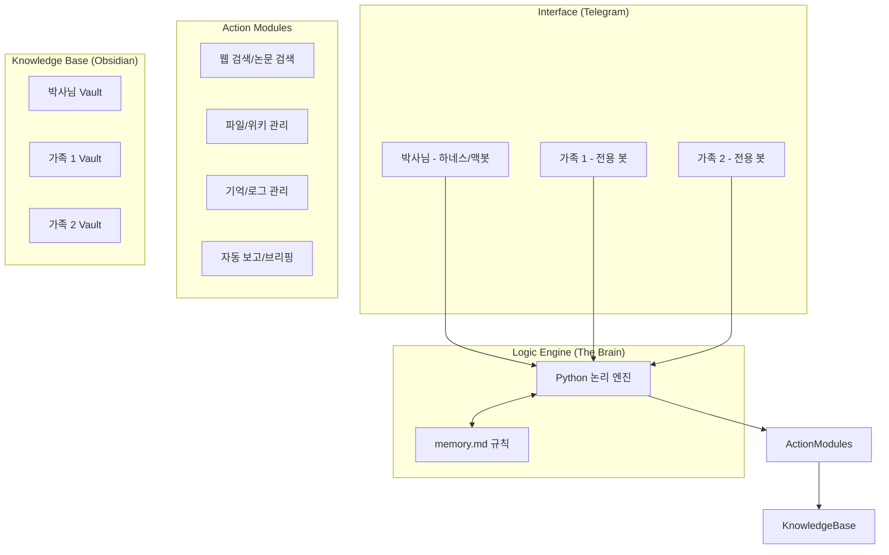

# 🚀 맥 스튜디오 지능화 구상도

본 문서는 박사님의 맥 스튜디오를 단순한 워크스테이션을 넘어, 온 가족의 지능형 중앙 서버로 진화시키기 위한 최종 구상도입니다.

---

## 🎯 최종 목표 (Master Vision)
> **"맥 스튜디오를 LLM처럼 작동시키되, 리소스 낭비 없는 규칙 기반의 자동화 머신으로 변모"**

---

## 📊 시스템 아키텍처 구상도

---

## 🚀 단계별 구현 전략

### 1단계: 맥봇(MacBot) 엔진 안착
-   **규칙 기반 의사결정**: "만약 기사에 'AI'가 있으면 AI_Trends 폴더로"와 같은 명확한 로직 구현.
-   **제로 리소스**: GPU를 점유하지 않고 상시 대기.

### 2단계: 정보 수집 최적화
-   **인제스트**: arXiv, NewsAPI, RSS 피드를 통한 자동 수집 및 마크다운 정렬.
-   **외부 연계**: Perplexity, Gemini, Claude 등 로컬 앱/API를 호출하여 답변 보강.

### 3단계: 가족 확장 (Multi-Tenant)
-   **개별 토큰**: 가족별 독립된 텔레그램 토큰 할당.
-   **개별 공간**: 가족별 독립된 Obsidian Vault 생성 및 관리 로직 분리.

### 4단계: 상황 관제 센터 (Local Dashboard)
-   **출장 중**: 텔레그램을 통한 원격 제어 및 보고.
-   **귀가 시**: 맥 스튜디오 모니터에서 시스템 상태 및 지식 맵 시각화(GUI).

---

## 🧠 LLM vs 맥봇 (규칙 기반) 비교

| 기능 | LLM 방식 | 맥봇 (규칙 기반) |
| :--- | :--- | :--- |
| **추론 속도** | 3~10초 | **0.1초 (즉각)** |
| **정확도** | 환각 위험 있음 | **100% 정확** |
| **자원 사용** | GPU/메모리 대량 점유 | **극저부하 (CPU 전용)** |
| **가족 확장** | 모델 여러 개 띄우기 힘듦 | **무제한 확장 가능** |

---
*최종 업데이트: 2026-05-15*
*작성자: Antigravity (박사님의 전용 코딩 파트너)*
