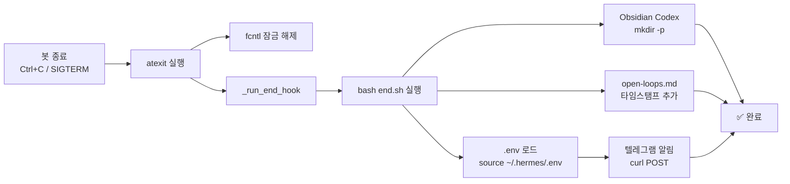

# 🛡️ `hooks/end.sh` — Life-Harness Layer 4 (Memory Close-out)

> **목적**: Hermes 텔레그램 봇 종료 시 자동으로 Obsidian Codex 동기화 + 텔레그램 알림 전송
> **위치**: `~/.hermes/hooks/end.sh`
> **연결 방식**: Python `atexit.register()` — 봇 프로세스 종료 시 자동 실행

---

## 📋 목차

1. [개요](#개요)
2. [동작 흐름](#동작-흐름)
3. [파일 구조](#파일-구조)
4. [자동 실행 (atexit)](#자동-실행-atexit)
5. [수동 실행](#수동-실행)
6. [로그 확인](#로그-확인)
7. [커스터마이징](#커스터마이징)
8. [문제 해결](#문제-해결)

---

## 개요

`hooks/end.sh`는 Hermes 텔레그램 봇(`hermes_local.py`)이 종료될 때 **Life-Harness Layer 4 (Memory Close-out)** 를 수행하는 종료 후크 스크립트입니다.

### 주요 기능

| 기능 | 설명 |
|:---|:---|
| 📂 **Obsidian Codex 동기화** | `wiki/Obsidian Codex/` 폴더 존재 보장 및 초기화 |
| 📝 **Open Loops 기록** | `open-loops.md`에 세션 종료 타임스탬프 자동 추가 |
| 🤖 **텔레그램 알림** | 봇 종료 사실을 박사님께 텔레그램으로 전송 |

### 위치

```bash
~/.hermes/hooks/end.sh
# 실제 경로: /Users/bluesea/.hermes/hooks/end.sh
```

---

## 동작 흐름



### 상세 단계

1. **트리거**: 봇 프로세스가 종료될 때 Python `atexit` 핸들러가 `_run_end_hook()` 호출
2. **서브프로세스**: Python → `subprocess.run(["bash", "~/.hermes/hooks/end.sh"])`
3. **Obsidian Codex 확인**: `mkdir -p`로 폴더 존재 보장
4. **Open Loops 기록**: `open-loops.md`에 `---\n### 🕐 세션 종료: YYYY-MM-DD HH:mm:ss\n- 자동 Close-out 완료 (Layer 4)` 추가
5. **환경 변수 로드**: `source ~/.hermes/.env`로 텔레그램 토큰 획득 (공백/특수문자 안전)
6. **텔레그램 전송**: `curl`로 박사님께 종료 알림 메시지 전송

---

## 파일 구조

```
~/.hermes/
└── hooks/
    └── end.sh              ← 이 문서가 설명하는 스크립트

wiki/Obsidian Codex/
├── README.md               ← Codex 폴더 설명
├── open-loops.md           ← end.sh가 자동 기록하는 미해결 과제 파일
└── end.sh_가이드.md         ← 지금 보고 있는 이 문서
```

---

## 자동 실행 (atexit)

`hermes_local.py`의 `main()` 함수에 등록되어 있습니다.

### 등록 코드

```python
# hermes_local.py - atexit 등록 부분
import atexit
import subprocess

def _run_end_hook():
    """atexit 등록용: hooks/end.sh 실행"""
    hook_path = os.path.expanduser("~/.hermes/hooks/end.sh")
    if os.path.exists(hook_path):
        try:
            result = subprocess.run(
                ["bash", hook_path],
                capture_output=True, text=True, timeout=30
            )
            if result.returncode == 0:
                logger.info(f"[Close-out] end.sh 완료: {result.stdout.strip()}")
            else:
                logger.warning(f"[Close-out] end.sh 오류: {result.stderr.strip()}")
        except Exception as e:
            logger.exception(f"[Close-out] end.sh 실행 실패: {e}")

# main() 내부
atexit.register(_run_end_hook)  # ← 봇 종료 시 자동 실행
```

### 실행 조건

- `atexit`는 프로세스가 **정상 종료**될 때 실행됩니다.
- `SIGKILL`(-9)로 강제 종료 시에는 실행되지 않습니다.
- `SIGTERM`(kill), `SIGINT`(Ctrl+C)로 종료 시 정상 실행됩니다.

---

## 수동 실행

디버깅이나 테스트 목적으로 직접 실행할 수도 있습니다.

```bash
# 기본 실행
bash ~/.hermes/hooks/end.sh

# 실행 결과 확인
bash ~/.hermes/hooks/end.sh && echo "✅ 성공"
```

> **⚠️ 참고**: 수동 실행 시에도 텔레그램으로 알림이 전송됩니다.
> 테스트 시에는 `.env` 파일이 정상 로드되는지 확인하세요.

---

## 로그 확인

`end.sh` 실행 로그는 `hermes_local.py`의 HermesOrchestrator 로거를 통해 기록됩니다.

```bash
# Launchd 로그 확인
tail -20 ~/Applications/Mjauto/Scripts/hermes_launchd.log

# end.sh 표준 출력 직접 확인
bash ~/.hermes/hooks/end.sh

# open-loops.md 확인 (가장 최근 기록)
tail -10 "/Users/bluesea/Applications/Mjobsidian/wiki/Obsidian Codex/open-loops.md"
```

---

## 커스터마이징

`end.sh`를 수정하여 동작을 확장할 수 있습니다.

### 예시: 추가 기능

```bash
# end.sh에 추가할 수 있는 기능들

# 1. hot.md 업데이트
HOT_MD="/Users/bluesea/Applications/Mjobsidian/wiki/00_Meta/hot.md"
echo "- [자동] 봇 종료: ${NOW}" >> "$HOT_MD"

# 2. 시스템 스냅샷 저장
uptime >> "${OBSIDIAN_CODEX}/sessions/session-${NOW//[: ]/_}.md"

# 3. 디스크 상태 기록
df -h / >> "${OBSIDIAN_CODEX}/sessions/disk-${NOW//[: ]/_}.md"
```

---

## 문제 해결

### ❌ end.sh가 실행되지 않아요

**원인**: `atexit`가 등록되지 않았거나, 강제 종료(SIGKILL)된 경우

**확인**:
```bash
# 1. atexit 등록 확인
grep -n "atexit.register.*_run_end_hook" ~/Applications/Mjauto/Scripts/hermes_local.py

# 2. 수동 실행 테스트
bash ~/.hermes/hooks/end.sh
```

---

### ❌ 텔레그램 알림이 안 와요

**원인**: `.env` 파일 문제 또는 `curl` 실패

**확인**:
```bash
# 1. .env 파일 존재 확인
ls -la ~/.hermes/.env

# 2. 토큰 확인 (부분 출력)
grep TELEGRAM_BOT_TOKEN ~/.hermes/.env | cut -c1-30

# 3. curl 테스트
source ~/.hermes/.env
curl -s "https://api.telegram.org/bot${TELEGRAM_BOT_TOKEN}/getMe"
```

---

### ❌ open-loops.md에 기록이 안 남아요

**원인**: `OBSIDIAN_CODEX` 경로가 잘못되었거나 쓰기 권한 문제

**확인**:
```bash
# 1. 경로 확인
ls -la "/Users/bluesea/Applications/Mjobsidian/wiki/Obsidian Codex/"

# 2. 쓰기 권한 확인
touch "/Users/bluesea/Applications/Mjobsidian/wiki/Obsidian Codex/test.txt"
rm "/Users/bluesea/Applications/Mjobsidian/wiki/Obsidian Codex/test.txt"
```

---

## 참고

- **원리**: [Life-Harness 아키텍처 (arXiv 2605.22166)](https://arxiv.org/abs/2605.22166)
- **Layer 3**: `modules/action_realization_layer.py` (Action Validation)
- **Layer 4**: `~/.hermes/hooks/end.sh` (Memory Close-out) ← 현재 문서
- **소스 코드**: `hermes_local.py` → `_run_end_hook()` + `atexit.register()`

---

*최종 업데이트: 2026-05-24*
*작성자: Hermes AI Agent*
